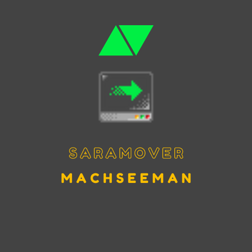

### saraMover

Move your desired items with automation!

---

<p align = 'center'>  </p>

If you need help implementing this, feels free to dm me at discord junssekut#4964 or join my [discord server](https://dsc.gg/machseeman).

## Output
> The output of the script would be:

Will be updated later.

## How To Use

There is currently 4 different methods of moving items, such as:
| Command |      Alias     |                         Description                        |
|:-------:|:--------------:|:----------------------------------------------------------:|
|  `wtw`  | World to World | Move your items from dropped to dropped.                   |
|  `vtw`  |  Vend to World | Move your items from vending machines to dropped.          |
|  `wtv`  |  World to Vend | Move your items from dropped to vending machines.          |
|  `vtv`  |  Vend to Vend  | Move your items from vending machines to vending machines. |

You can use these methods and they will work even if your vending is empty, they will insert the item into the vending and adapt to how it's designed to work correctly. However, there are specifications to use some of these methods:
|      Key     | Expected Type | Required | Description                                                                                                                                                                  |
|:------------:|:-------------:|:--------:|------------------------------------------------------------------------------------------------------------------------------------------------------------------------------|
|   `command`  |     string    |    Yes   | The command to make your bot move your items as you wish, see above for command list.                                                                                        |
|    `from`    |     string    |    Yes   | The world to take your items from, support with or without door id ( `worldname` or `worldname:doorid` ).                                                                    |
|     `to`     |     string    |    Yes   | The world to store your items to, support with or without door id ( `worldname` or `worldname:doorid` ).                                                                     |
|    `item`    |     number    |    Yes   | The item id to move.                                                                                                                                                         |
| `background` |     number    |    No    | The item id of your background tiles to drop the item to, by default if you use the command `wtw` or `vtw` it will use no background if you don't specify the background id. |

> Creating your custom config:
```lua
local config = {
    --- You can add up unlimited commands here.
    commands = {
        { command = 'wtw', from = 'world1', to = 'world1a', item = 4585, background = 880 },
        { command = 'vtw', from = 'world2:doorid', to = 'world2a:doorid', item = 4585, background = 880 },
        { command = 'wtv', from = 'world3:doorid', to = 'world3a:doorid', item = 4585 },
        { command = 'vtv', from = 'world4:doorid', to = 'world4a:doorid', item = 4585 },
    },

    --- Optional to use only for one door id for your worlds.
    id = 'doorid',

    --- Webhook URL to send the information of your bots activities.
    webhook = 'https://discord.com/api/webhooks/etc'
}
```

> Add this code inside your script (online fetch):
```lua
--- Fetch the online script and load it.
local saraMover = assert(load(request('GET', 'https://raw.githubusercontent.com/junssekut/saraMover/main/src/saraMover-src.lua'))())

--- Initialize with your custom config!
local status, message = pcall(saraMover.init, config)

if not status then error('An error occured, please see error_logs.txt\n' .. message) end
```

> Add this code inside your script if you want it offline or locally ( not recommended, since you won't get any updates or fixes ):
```lua
--- 'saraMover.lua' must be the same folder as Pandora.
local saraMover = require('saraMover')

--- Initialize with your custom config!
local status, message = pcall(saraMover.init, config)

if not status then error('An error occured, please see error_logs.txt\n' .. message) end
```
